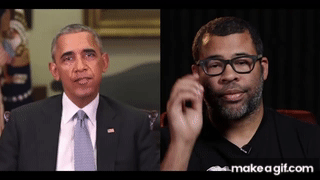
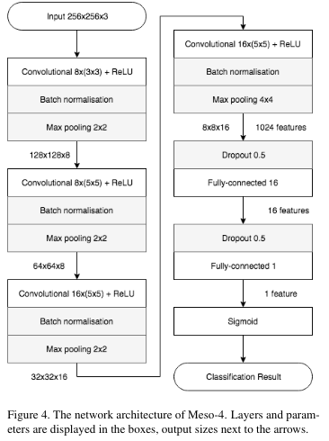
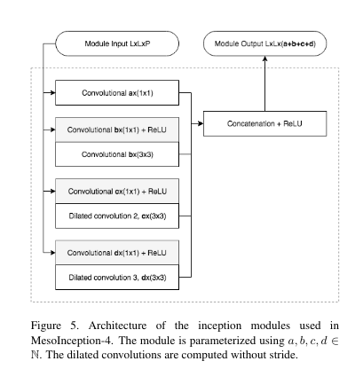

# Deepfake-detector

Building a MesoNet4 network &amp; deploying it online

## Context 

Deepfakes have become a growing issue, especially with the development of more robust **Generative Adversarial Networks (GANs)**. Altough GANs were first introduced in 2014 [[1]](#1), the recent advances in computer vision have allowed them to create synthetic images and videos of celebrities or politicians.

The use of deepfakes in fake news, hoaxes and even financial fraud have garnered, much needed attention, both politically and academically, to try to limit their use and propagation. One such attempt, is the **MesoNet**, a neural network architecture, created by Darius Afchar &amp; al. in 2018 [[2]](#2) to help stem the deepfake tide.

## Paper

MesoNet-4 was developed by a team of three researchers in 2018 [[2]](#2) is an attempt at detecting face tampering in videos.

### Dataset

### Model architecture
Meso-4 Architecture           |  Inception modules for MesoInception-4
:-------------------------:|:-------------------------:
 |  

### Theoretical results

## Project

## How to use ?

## Advantages and shortcomings

## References
<a id="1">[1]</a> 
_Ian J. Goodfellow &amp; al. (2014). 
Generative Adversarial Networks.
Advances in Neural Information Processing Systems 27_

<a id="2">[2]</a> 
_Darius Afchar &amp; al. (2018). 
MesoNet: a Compact Facial Video Forgery Detection Network_
